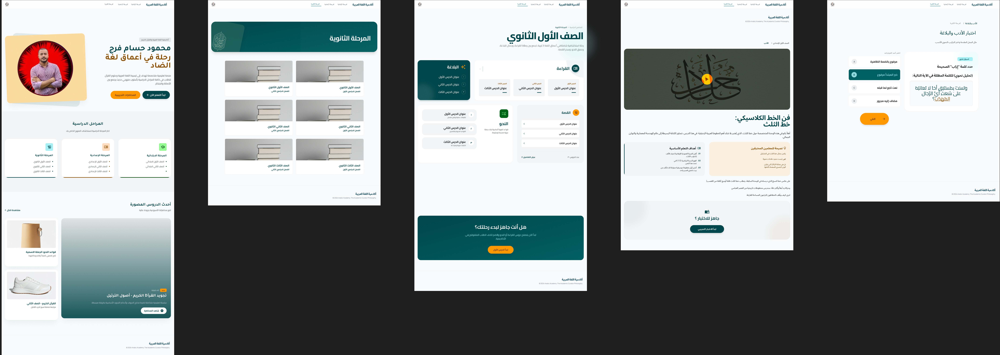

# Arabic Academy | Academic Platform 📚

**Arabic Academy** is a custom-engineered WordPress solution built for educators to deliver structured lessons and interactive assessments. This project demonstrates a deep integration of the modern WordPress stack, moving beyond simple site-building into custom plugin architecture and the **Interactivity API**.

---

## 🚀 Technical Architecture

### 🛠️ Custom Plugin Development
To ensure a clean separation of concerns and data portability, I developed a core functional plugin to handle the site's unique data structures:
* **Custom Post Types (CPT):** Registered `Lessons` and `Tests` to manage educational content independently of standard blog posts.
* **Custom Taxonomies:** Implemented `Class` (Grade Level) and `Branch` (Subject Matter, e.g., Grammar, Literature) for advanced filtering and organization.

### ⚡ Advanced APIs & Modern WordPress
* **Interactivity API:** Leveraged the new WordPress Interactivity API for the **Test engine**. This allows students to interact with quizzes—selecting answers and receiving instant feedback—without a full page reload, providing a "native app" feel.
* **RESTful API Deployment:** Optimized custom endpoints to fetch and deliver lesson data asynchronously, ensuring a fast, decoupled user experience.
* **Custom Blocks:** Developed proprietary Gutenberg blocks tailored specifically for educational layouts.

### 🎨 UI/UX & Design Workflow
The project features a high-tech, data-driven aesthetic with a focus on readability and "Seed Cyan" influenced color theory.
* **The Workflow:** I designed the first-stage UI to establish the core user journey, then utilized **AI-assisted design tools** to refine the color palettes, typography, and spacing for a professional, polished finish.
* **Figma to Code:** Translated complex Figma prototypes into a fully responsive, custom WordPress theme.
* **Customization:** Fully bespoke Header, Footer, and page templates built from scratch.

---

## 📸 Interface Preview

The interface utilizes modern design principles like glassmorphism and clear hierarchy to facilitate learning.

---

## 🛠️ Tech Stack
* **Core:** WordPress (PHP)
* **Frontend:** JavaScript (Interactivity API), CSS3 (Custom Variables)
* **Design:** Figma & AI-Polishing Tools
* **Data:** RESTful API & Custom Taxonomy queries

---

## 💡 Engineering Skills Showcased
* **Plugin Development:** Creating scalable, hook-based WordPress logic.
* **Modern JavaScript:** Implementing the Interactivity API for real-time UI updates.
* **Full-Stack Strategy:** Bridging backend data (CPTs) with high-performance frontend delivery.
* **Hybrid Design:** Combining manual UI/UX expertise with AI tools to achieve a superior aesthetic.
